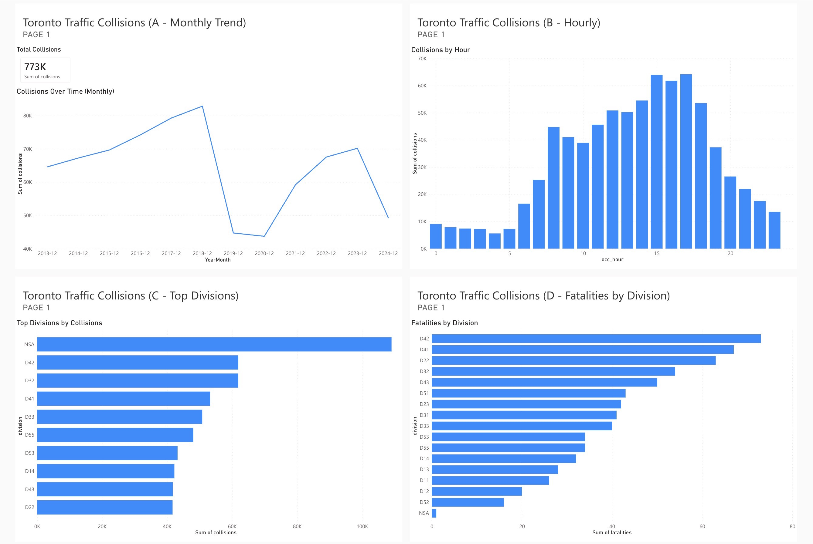

# Toronto Traffic Collisions Dashboard (SQL + Power BI)

## Goal
Analyze traffic collision patterns in Toronto by **month**, **hour**, and **police division**, and highlight where fatalities are most concentrated.

## Tools
- SQL for cleaning + aggregation
- Power BI (Service / browser) for visuals + dashboard

## What I built
- **Monthly collisions trend** (line chart)
- **Collisions by hour** (column chart)
- **Top divisions by collisions** (bar chart)
- **Fatalities by division** (bar chart)

## Key insights
- Highest collision division: **NSC**
- Highest fatalities division: **D42**
- Collision volume varies by time of day and month (see dashboard)

## How to reproduce
1. Download the dataset as CSV and import into SQL as a table named `traffic_collisions_raw`.
2. Run `sql/queries.sql` to create `collisions_clean` and generate the A–D summary tables.
3. Export each A–D query result as CSV into the `data/` folder.
4. Upload the CSVs to Power BI Service and recreate the visuals (then pin to a dashboard).

## Repo structure
- `sql/queries.sql` — view creation + analysis queries
- `data/` — exported summary tables (A–D)
- `screenshots/` — final dashboard image

## Data source
Toronto Open Data — Traffic Collisions (CSV download):
https://data.torontopolice.on.ca/datasets/TorontoPS::traffic-collisions-open-data-asr-t-tbl-001/about
